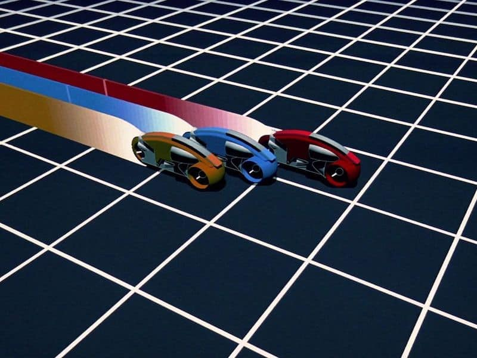

# Week three: Multiplayer battle tron

## Rules of Tron :bullettrain_side:

You control a [LightCycle](https://en.wikipedia.org/wiki/Light_Cycle) and must defeat your enemies.

You are navigating a grid. At each timestep, you can take 1 of 3 possible actions to navigate.

1. Move forward
2. Turn left
3. Turn right.

**Moving forward** will continue the bike moving in the same direction 1 square.

**Turning left** or **right** will change the direction of the bike in that direction, and move the bike forward 1 square in that direction.

### The game

Each step you drive forward, your light tail extends behind you

If you **hit any walls** or you **collide with another bike's tail** (including youself) then you die, and the **game ends**

You win and are rewarded if you are vanquish your opponents and remain the last bike standing.

### Opponents

You will share the arena with multiple **opponents**!

These **opponents** are subject to the same rules and logic as you.

Your **goal** is to defeat your opponents.

# Competition Rules :scroll:

1. You must build an agent to play tron using either a **reinforcement learning** algorithm or a **heuristic search algorithm** (such as monte carlo tree search :deciduous_tree:)
2. You can only write code in `main.py`
   - You can only store data to be used in a competition in a `.pt` file by `save_network()` (it is not mandatory to use this however).
   - In the competition, your agent will call the `choose_move()` function in `main.py` to select a move (`choose_move()` may call other functions in `main.py`)
   - Any code not in `main.py` will not be used.
3. Submission deadline: **2pm UTC, Sunday**.
   - You can update your code after submitting, but **not after the deadline**.
   - **Check your submission is valid with `check_submission()`**

## Competition Format :crossed_swords:

Each matchup will be played on a single board with all submitted agents. So your should make sure your agent works against `N` opponents!

The competition will consist of multiple rounds with the ranking of bots in each round decided through the same method as the **training environment**

The competition & discussion will be in [Gather Town](https://app.gather.town/app/nJwquzJjD4TLKcTy/Delta%20Academy) at **3pm UTC on Sunday** (60 mins after submission deadline)!

## Technical Details :hammer:

### Rewards :moneybag:

Your reward :moneybag: is:

`+1` for winning the game.

Otherwise your reward is `0`

### Observations each timestep :mag:

The **tuple** returned from each `env.step()` has:

- A **dictionary** :book: describing the positions of objects on the board

  - `player_bike`: **list** of **tuples** describing your bike's coordinates\* on the grid location
  - `player_orientation`: **int** the orientation of your bike (see Orientation in game_mechanics)
  - `opponent_bikes`: a **list** of **lists** of **tuples** decribing the living opponent bikes coordinates\*
  - `opponent_orientations`: a **list** of **ints** describing the living opponent bikes orientations (see Orientation in game_mechanics)

- The reward for each timestep
- Whether the point is done (boolean)
- Extra information

\*The first tuple in the list is the front of the bike

## Arena Layout

The court is`ARENA_WIDTH` wide and`ARENA_HEIGHT`tall.

The width of the arena lies along the x-axis and the height along the y-axis.

**Positions:** top left corner is at `(0, 0)`, the bottom right corner is at `(ARENA_WIDTH, ARENA_HEIGHT)` and the top right corner is at `(ARENA_WIDTH, 0)`.

**Bikes (your bike is red)** moves East, West, North, and South. The bike cannot move diagonally.

## Functions you write :point_left:

<code style="white-space:nowrap;">  train()</code>

Write this to train your algorithm from experience in the environment.
 
 
(Optional) Return a trained network so it can be saved.

<code style="white-space:nowrap;">  choose_move()</code>

This acts greedily given the state and network.

In the competition, the choose_move() function is called to make your next move. Takes the state as input and outputs an action.

## Existing Code :pray:

<code style="white-space:nowrap;">  TronEnv</code>

The environment class controls the game and runs the opponents. It should be used for training your agent.
 
 
See example usage in <code style="white-space:nowrap;">play_tron()</code>.
 
 
The opponents' <code style="white-space:nowrap;">choose_move</code> functions are input at initialisation (when <code style="white-space:nowrap;">Env(opponent_choose_moves)</code> is called). Every time you call <code style="white-space:nowrap;">Env.step()</code>, all bikes make a move according to their choose_move function. All player's perspecitves on the arena is the same but they will recieve their own position as player_bike in the state dictionary.
     
     

<code style="white-space:nowrap;">TronEnv</code> has a <code style="white-space:nowrap;"> verbose</code> argument which prints the information about the game to the console when set to <code style="white-space:nowrap;">True</code>. <code style="white-space:nowrap;"> TronEnv</code> also has a render argument which visualises the game in pygame when set to <code style="white-space:nowrap;">True</code>. This allows you to visualise your AI's skills. You can play against your agent using the <code style="white-space:nowrap;">human_choose_move()</code> function!

<code style="white-space:nowrap;"> choose_move_square()</code>

A basic tron bot that won't die immediately, a useful first opponent!
 
 
Takes the state as input and outputs an action.

<code style="white-space:nowrap;">  play_tron()</code>

Plays a game of tron, which can be rendered through pygame (if <code style="white-space:nowrap;">render=True</code>).

You can play against your own bot if you set <code style="white-space:nowrap;">your_choose_move</code> to <code style="white-space:nowrap;">human_player</code>!
 
 
Inputs:

<code style="white-space:nowrap;">your_choose_move</code>: Function that takes the state and outputs the action for your agent.

<code style="white-space:nowrap;">opponent_choose_move</code>: Function that takes the state and outputs the action for the opponent.

<code style="white-space:nowrap;">game_speed_multiplier</code>: controls the gameplay speed. High numbers mean fast games, low numbers mean slow games.

<code style="white-space:nowrap;">verbose</code>: whether to print info to the console.

<code style="white-space:nowrap;">render</code>: whether to render the match through pygame

## Suggested Approach :+1:

1. Use monte carlo tree search to simlulate possible future trajectories>
2. **Write `train()`**, borrowing from past exercises
3. **Iterate, iterate, iterate** on that `train()` function
4. **Print out important values** - otherwise bugs in your code may slip through the cracks :astonished:
